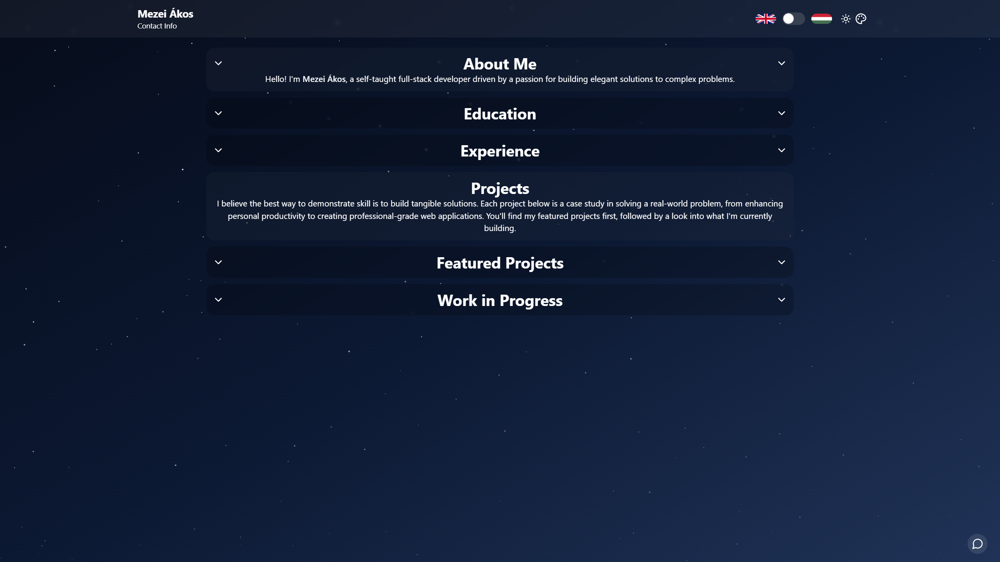
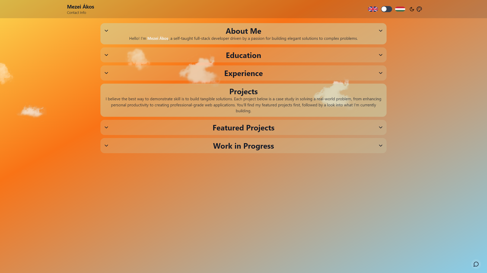

# Personal Portfolio & Full-Stack Messaging Platform

This is the repository for my personal portfolio website, built from the ground up to be a fast, interactive, and modern showcase of my skills as a developer.

**[➡️ View the Live Site](https://www.mezeiakos.cv)**

## About This Project

This website is a **living demonstration of my full-stack development capabilities**. The goal was to build a site that is not just a document, but a high-performance, full-stack Single-Page Application (SPA) that showcases a wide range of technical skills and architectural patterns—from a polished, animated frontend to a secure, containerized backend API.

Every component was built from scratch (excluding the listed libraries) to demonstrate a deep understanding of core web technologies and modern development patterns.

---

## Technical Stack

| Category       | Technology                                                                                                                                    |
|----------------|-----------------------------------------------------------------------------------------------------------------------------------------------|
| **Frontend**   | [React](https://react.dev/), [TypeScript](https://www.typescriptlang.org/), [Vite](https://vitejs.dev/)                           |
| **Styling**    | [Tailwind CSS](https://tailwindcss.com/)                                                                                                      |
| **Animation**  | [Framer Motion](https://www.framer.com/motion/)                                                                                               |
| **API**        | [.NET 8 REST API](https://dotnet.microsoft.com/en-us/) (C#)                                                                                   |
| **Database**   | [MongoDB](https://www.mongodb.com/)                                                                                                           |
| **Deployment** | Frontend on [Vercel](https://vercel.com/), API in [Docker](https://www.docker.com/) container on [DigitalOcean](https://www.digitalocean.com/) |

---

## Architecture & Key Features

The site is built with a decoupled architecture, consisting of a React frontend, a .NET backend API, and a serverless Backend-for-Frontend (BFF).

### Frontend

A high-performance Single-Page Application built with React, TypeScript, and Vite, featuring a responsive UI styled with Tailwind CSS and animated with Framer Motion.

#### **Key Features:**

*   **Dynamic, Weather-Aware Background:** The background is fully dynamic, changing based on both the time of day and real-world weather conditions.
    *   **Time-Based Gradients:** Both light and dark themes feature background gradients that smoothly transition between color schemes for morning, midday, evening, and night.
    *   **Dynamic Weather Effects:** The light theme dynamically generates and animates clouds based on the user's local weather, while the dark theme features a parallax starfield effect.

*   **Frictionless Messaging UI:** A custom-built, two-way messaging system designed for ease of use. To minimize friction, users can send messages without any sign-up process. A unique `chatID` is generated and stored in `localStorage`, allowing returning users to seamlessly continue their conversations.

*   **Interactive Tech Links:** Throughout the site's text, mentions of technologies are interactive links. On hover, they dynamically change color to match the official branding of the technology—for instance, Vite displays its signature gradient.

*   **Multi-Language Support:** The portfolio supports multiple languages via i18n.

### Backend & Infrastructure

The backend consists of a secure REST API for the messaging system and a serverless function for weather data, both designed for security and scalability.

#### **API Architecture & Technologies:**

*   **Framework:** The messaging system is powered by a REST API built with .NET 8 (C#). It follows a clean architectural pattern with controllers, a dedicated `MessageService` for business logic, and clear data models.
*   **Database:** MongoDB serves as the NoSQL database. A conversation, including all its messages, is stored as a single document, which is an efficient design for this use case.
*   **Deployment:** The .NET API is containerized using Docker and deployed on DigitalOcean.

#### **Security & Configuration:**

*   **Authentication & Authorization:** The API is secured using a custom, policy-based system. It uses a custom `ApiKeyHandler` to validate keys in the `X-API-Key` header and defines separate policies for "User" and "Admin" roles for granular endpoint control.
*   **Configuration Management:** Sensitive data like connection strings and API keys are pulled from environment variables, with fallbacks to local configuration files for development.
*   **CORS Policy:** A strict Cross-Origin Resource Sharing (CORS) policy is configured to only allow requests from the portfolio's domain and localhost.

#### **Weather Service (Backend-for-Frontend):**

A Vercel serverless function acts as a Backend-for-Frontend (BFF). This was built to securely hide third-party API keys from the client and create a resilient system that doesn’t rely on a single weather provider. It calls multiple weather APIs, normalizes their varied data formats into a single category ("clear," "cloudy," or "stormy"), and returns a consensus result to the frontend.

---

## Roadmap & Future Enhancements

This project is actively maintained. Here are some of the key improvements planned:

### Core Architecture & Security

-   **End-to-End Message Encryption (E2EE):** To guarantee user privacy, the plan is to implement E2EE for the chat. This would involve generating a client-side public/private key pair on chat initiation and using it to encrypt message content before it's sent to the API.
-   **Real-Time Communication with WebSockets:** A significant planned upgrade is to transition to a WebSocket-based connection (likely using SignalR for .NET) to provide true real-time, bidirectional communication.

### Frontend & User Experience

-   **Adaptive Performance Monitoring:** Implement a client-side performance monitor that measures the frame rate. If a sustained drop is detected, a non-intrusive UI element will appear, offering the user the option to disable performance-intensive effects.

---

## Transparency Notice

-   **AI** was used to format the translation file.
-   **AI** was also used to comment parts of code.